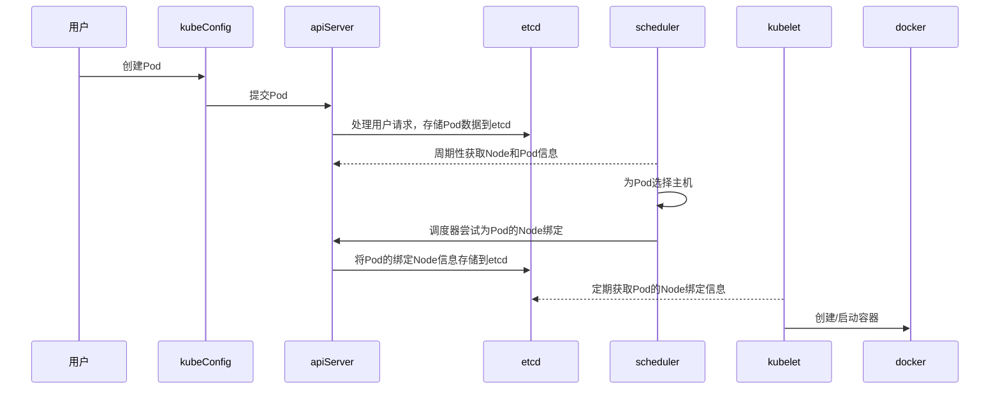

## 6.Kubernetes Pod 介绍

### 1. Pod 介绍与原理讲解
是 Kubernetes 项目中最小的 API 对象。如果换一个更专业的说法，我们可以这样描述：
Pod，是 Kubernetes 项目的原子调度单位。

Pod 是运行服务的基础。基础容器是 pause。 每启动一个Pod 都会附加启动这样一个容器，它的作用就只是简单的等待，设置 Pod 的网
络。
一个 Pod 中的应用容器共享同一组资源：
1. PID 命名空间：Pod 中的不同应用程序可以看见其他应用程序的进程 ID
2. 网络命名空间：Pod 中的多个容器能访问同一个 IP 和端口范围
3. IPC 命名空间：Pod 中的多个容器能够使用 SystemV IPC 或 POSIX 消息队列进行通信。
4. UTS 命名空间：Pod 中的多个容器共享一个主机名
5. Volumes(共享存储卷):Pod 中的各个容器可以访问在 Pod 级别定义的 Volumes

每个 pod 中容器的镜像应该不同（不同的应用），避免端口重复

> - 最小操作但愿
> - Pod内容器共享资源
> - 生命周期管理：挂起、运行、成功、失败、未知
> - 容器探测：LivenessProbe ReadinessProbe
> - 容器配额：request limit
### 2. Pod 创建与删除

#### 1.kubectl 创建 Pod
```shell
kubectl run nginx --image=nginx:1.9 –port=80
```
状态检查：
```shell
kubectl get pod name
kubectl describe pod name
kubectl logs name
```
#### 2.Yaml 基本语法规则
```yaml
# yaml格式的pod定义文件完整内容：
apiVersion: v1       #必选，版本号，例如v1
kind: Pod       #必选，Pod
metadata: #必选，元数据
  name: string       #必选，Pod名称
  namespace: string    #必选，Pod所属的命名空间
  labels: #自定义标签
    - name: string     #自定义标签名字
  annotations: #自定义注释列表
    - name: string
spec: #必选，Pod中容器的详细定义
  containers: #必选，Pod中容器列表
    - name: string     #必选，容器名称
      image: string    #必选，容器的镜像名称
      imagePullPolicy: [ Always | Never | IfNotPresent ] #获取镜像的策略 Alawys表示下载镜像 IfnotPresent表示优先使用本地镜像，否则下载镜像，Nerver表示仅使用本地镜像
      command: [ string ]    #容器的启动命令列表，如不指定，使用打包时使用的启动命令
      args: [ string ]     #容器的启动命令参数列表
      workingDir: string     #容器的工作目录
      volumeMounts: #挂载到容器内部的存储卷配置
        - name: string     #引用pod定义的共享存储卷的名称，需用volumes[]部分定义的的卷名
          mountPath: string    #存储卷在容器内mount的绝对路径，应少于512字符
          readOnly: boolean    #是否为只读模式
      ports: #需要暴露的端口库号列表
        - name: string     #端口号名称
          containerPort: int   #容器需要监听的端口号
          hostPort: int    #容器所在主机需要监听的端口号，默认与Container相同
          protocol: string     #端口协议，支持TCP和UDP，默认TCP
      env: #容器运行前需设置的环境变量列表
        - name: string     #环境变量名称
          value: string    #环境变量的值
      resources: #资源限制和请求的设置
        limits: #资源限制的设置
          cpu: string    #Cpu的限制，单位为core数，将用于docker run --cpu-shares参数
          memory: string     #内存限制，单位可以为Mib/Gib，将用于docker run --memory参数
        requests: #资源请求的设置
          cpu: string    #Cpu请求，容器启动的初始可用数量
          memory: string     #内存清楚，容器启动的初始可用数量
      livenessProbe: #对Pod内个容器健康检查的设置，当探测无响应几次后将自动重启该容器，检查方法有exec、httpGet和tcpSocket，对一个容器只需设置其中一种方法即可
        exec: #对Pod容器内检查方式设置为exec方式
          command: [ string ]  #exec方式需要制定的命令或脚本
        httpGet: #对Pod内个容器健康检查方法设置为HttpGet，需要制定Path、port
          path: string
          port: number
          host: string
          scheme: string
          HttpHeaders:
          - name: string
            value: string
        tcpSocket: #对Pod内个容器健康检查方式设置为tcpSocket方式
          port: number
          initialDelaySeconds: 0  #容器启动完成后首次探测的时间，单位为秒
          timeoutSeconds: 0   #对容器健康检查探测等待响应的超时时间，单位秒，默认1秒
          periodSeconds: 0    #对容器监控检查的定期探测时间设置，单位秒，默认10秒一次
          successThreshold: 0
          failureThreshold: 0
          securityContext:
            privileged:false
      restartPolicy: [ Always | Never | OnFailure] #Pod的重启策略，Always表示一旦不管以何种方式终止运行，kubelet都将重启，OnFailure表示只有Pod以非0退出码退出才重启，Nerver表示不再重启该Pod
      nodeSelector:   #设置NodeSelector表示将该Pod调度到包含这个label的node上，以key：value的格式指定
      imagePullSecrets:  #Pull镜像时使用的secret名称，以key：secretkey格式指定
      - name: string
      hostNetwork: false      #是否使用主机网络模式，默认为false，如果设置为true，表示使用宿主机网络
      volumes: #在该pod上定义共享存储卷列表
      - name: string     #共享存储卷名称 （volumes类型有很多种）
        emptyDir: { }     #类型为emtyDir的存储卷，与Pod同生命周期的一个临时目录。为空值
        hostPath: string     #类型为hostPath的存储卷，表示挂载Pod所在宿主机的目录
        path: string     #Pod所在宿主机的目录，将被用于同期中mount的目录
        secret: #类型为secret的存储卷，挂载集群与定义的secre对象到容器内部
          scretname: string
          items:
          - key: string
            path: string
        configMap: #类型为configMap的存储卷，挂载预定义的configMap对象到容器内部
          name: string
          items:
          - key: string
            path: string
```
#### 3.Yaml 文件创建 Pod
```shell
kubectl run nginx --image=nginx --port=80 --dry-run=client -o yaml>nginx.yaml

cat nginx.yaml
```
```yaml
apiVersion: v1
kind: Pod
metadata:
  creationTimestamp: null
  labels:
  run: nginx
  name: nginx
spec:
  containers:
  - image: nginx
  name: nginx
  ports:
  - containerPort: 80
  resources: {}
  dnsPolicy: ClusterFirst
  restartPolicy: Always
status: {}
```
#### 4.多容器 Pod 创建
```yaml
apiVersion: v1
kind: Pod
metadata:
  creationTimestamp: null
  labels:
    run: nginx
  name: multi-container
spec:
  containers:
  - image: nginx
    name: nginx
    ports:
    - containerPort: 80
    resources: {}
  - image: tomcat
    name: tomcat
    ports:
    - containerPort: 8080
  dnsPolicy: ClusterFirst
  restartPolicy: Always
status: {}
```
### 3. Pod 生命周期管理
Pod 在整个生命周期过程中被系统定义为各种状态，熟悉 Pod 的各种状态对于我们理解如何设置 Pod 的调度策略、重启策略是很有必要的。
Pod 状态如表所示：

| 状态值    | 描述                                                    |
|--------|-------------------------------------------------------|
| Pending | API Server已经创建该Pod，但在Pod内还有一个或多个容器对镜像没有创建，包括正在下载镜像对过程 |
| Running | Pod内所有容器均已创建，且至少有一个容器处于运行状态，正在启动状态对或正在重启状态            |
| Succeeded      | Pod内所有容器均成功执行后退出，且不会重启                                |
| Failed       | Pod内所有容器均已退出，但至少有一个容器退出为失败状态                          |
| Unknown       | 由于某种原因无法获取该Pod的状态，可能由于网络通信导致                          |

Pod 的重启策略（ RestartPolicy ）应用于 Pod 内的所有容器，并且仅在 Pod 所处的 Node 上由 kubelet 进行判断和重启操作。
当某个容器异常退出或者健康检查失败时， kubelet 将根据 RestartPolicy 的设置来进行相应的操作 。

Pod 的重启策略包括 Always 、 OnFailure 和 Never ， 默认值为 Always 。
> -  Always ： 当容器失效时，由 kubelet 自动重启该容器。
> -  OnFailure ： 当容器终止运行且退出码不为 0 时，由 kubelet 自动重启该容器。
> -  Never ：不论容器运行状态如何， kubelet 都不会重启该容器。

RestartPolicy 和 Pod 里容器的状态对应关系:

1. 只要 Pod 的 restartPolicy 指定的策略是Always，那么这个Pod 就会保持 Running 状态，并进行容器重启。
2. 对于包含多个容器的 Pod，只有它里面所有的容器都进入异常状态后，Pod 才会进入 Failed 状态。

kubelet 重启失效容器的时间间隔以 sync-frequency 乘以 2n 来计算；例如 1、 2 、 4 、 8 倍等，最长延时 5min ，并且在成功重启后的 10min 后重置该时间。

Pod 的 重启策略与控制方式息息相关，当前可用于管理 Pod 的控制器包括RC 、 Job 、 DaemonSet 及直接通过 kubelet 管理（静态 Pod ） 。
每种控制器对 Pod的重启策略要求如下：

 - RC 和 DaemonSet ：必须设置为 Always ，需要保证该容器持续运行。

- Job: OnFailure 或 Never ，确保容器执行完成后不再重启。
- kubelet : 在 Pod 失效时自动重启它，不论将 RestartPolicy 设置为什么值，也不会对 Pod进行健康检查。

结合 Pod 的状态和重启策略，下表列出一些常见的状态转换场景。

| Pod包含容器数 | Pod当前状态 | 发生事件        | Always  | OnFailure | Never     |
| ------------- | ----------- | --------------- | ------- | --------- | --------- |
| 包含一个容器  | Running     | 容器成功退出    | Running | Successed | Successed |
| 包含一个容器  | Running     | 容器失败退出    | Running | Running   | Failed    |
| 包含两个容器  | Running     | 1个容器失败退出 | Running | Running   | Running   |
| 包含两个容器  | Running     | 容器被OOM杀掉   | Running | Running   | Failed    |

Kubernetes 为我们提供了两种钩子函数：

> **PostStart**：这个钩子在容器创建后立即执行。但是，并不能保证钩子将在容器ENTRYPOINT之前运行，因为没有参数传递给处理程序。主要用于资源部署、环境准备等。不过需要注意的是如果钩子花费太长时间以至于不能运行或者挂起， 容器将不能达到running状态。
>
> **PreStop**：这个钩子在容器终止之前立即被调用。它是阻塞的，意味着它是同步的， 所以它必须在删除容器的调用发出之前完成。主要用于优雅关闭应用程序、通知其他系统等。如果钩子在执行期间挂起， Pod阶段将停留在running状态并且永不会达到failed状态。

### 4 init container

在很多应用场景中，应用在启动之前都需要进行如下初始化操作，如：

- 等待其他关联组件正确运行（例如数据库或某个后台服务〉。
- 基于环境变量或配置模板生成配置文件。
- 从远程数据库获取本地所需配置，或者将自身注册到某个中央数据库中。
- 下载相关依赖包 ， 或者对系统进行一些预配置操作。

Kubernetes v1.3 引入了 一个 Alpha 版本的新特性 init container （在 Kubemetes v1.5 时被更新为 Beta 版本），用于在启动应用容器（ app container ）之前启动一个或多个“初始化 ”容器，完成应用容器所需的预置条件，如图 所示。 **Init container 与应用容器本质上是一样的 ，但它们是仅运行一次就结束的任务，并且必须在成功执行完成后，系统才能继续执行下一个容器**。根据 Pod 的重启策略（ Res tartPolicy ），当 init container 执行失败，在设置了 RestartPolicy=Never时， Pod 将会启动失败： 而设置 RestartPolicy=Always 时， Pod 将会被系统自动重启。

```yaml
apiVersion: v1
kind: Pod
metadata:
  name: javaweb
spec:
  initContainers:
  - image: registry.cn-shenzhen.aliyuncs.com/leedon/war-liuyanban
    name: war
    command: ["cp", "/liuyanban.war", "/app"]
    volumeMounts:
    - mountPath: /app
      name: app-volume
  containers:
  - image: registry.cn-shenzhen.aliyuncs.com/leedon/tomcat7
    name: tomcat
    volumeMounts:
    - mountPath: /opt/tomcat/webapps
      name: app-volume
    ports:
    - containerPort: 8080
      hostPort: 8001 
  volumes:
  - name: app-volume
    emptyDir: {}

```

### **5. Pod 的健康检查** 

在 Kubernetes 中，你可以为 Pod 里的容器定义一个健康检查`“探针”（Probe）`。
这样，kubelet 就会根据这个 Probe 的返回值决定这个容器的状态，而不是直接以容器进行是否运行（来自 Docker 返回的信息）作为依据。
这种机制，是生产环境中保证应用健康存活的重要手段。

对 Pod 的健康状态检查可以通过两类探针来检查： LivenessProbe 和 ReadinessProbe 。kubelet 定期执行这两种探针来诊断容器的健康状况 。

- **LivenessProbe** ：用于判断容器是否存活（ running 状态），如果 LivenessProbe 探针探测到容器不健康，则 kubelet 将杀掉该容器，并根据容器的重启策略做相应的处理。如果一个容器不包含 LivenessProbe 探针，那么 kubelet 认为该容器的 LivenessProbe 探针返回的值永远是“ Success"
- **ReadinessProbe**：用于判断容器是否启动完成（ ready 状态），可以接收请求。如果 ReadinessProbe 探针检测到失败，则 Pod 的状态将被修改。 系统将从Service 的 Endpoint 中删除包含该容器所在 Pod 的 Endpoint 。 这样就能保证客户端在访问 Service时 在访问 Service 时不会被转发到服务不可用的Pod实例上

LivenessProbe 和 ReadinessProbe 均可配置以下三种实现方式

- **ExecAction** ：在容器内部执行一个命令 ，如果该命令的返回码为 0 ，则表明容器健康 。
  ​ 在下面的例子中，通过执行“ test -f /tmp/healthy ”命令来判断一个容器运行是否正常。而该Pod 运行之后，在创建/tmp/healthy 文件的 30s 之后将删除该文件，而 LivenessProbe 健康检查的初始探测时间（ initialDelaySeconds ）为 15s ，探测结果将是 Fail ，将导致 kubelet 杀掉该容器井重启它。

  ```yaml
  livenessProbe:
        exec:
          command:                    # 执行LivenessProbe的命令,返回值为0,则说明容器是健康的
          - test
          - -f
          - /tmp/healthy
        initialDelaySeconds: 15       # 容器启动 15s后开始执行
        periodSeconds: 5              # 每 5s执行一次
  ```

- **TCPSocketAction** ：通过容器的 IP 地址和端口号执行 TCP 检查，如果能够建立 TCP 连接，则表明容器健康。

  ```yaml
  livenessProbe:
        tcpSocket:
          port: 80
        initialDelaySeconds: 30
        timeoutSeconds: 1
  ```

- **HTTPGetAction** ： 通过容器的 IP 地址、端口号及路径调用 HTTP Get 方法，如果响应的状态码大于等于 200 且小于 400，则认为容器状态健康。在下面的例子中， kubelet 定时发送 HTTP 请求到 localhost:80/_status/healthz 来进行容器应用的健康检查。

  ```yaml
  livenessProbe:
          httpGet:
            port: 80
            path: /_status/health 
          initialDelaySeconds: 30
          periodSeconds: 3
  ```


### 6. Pod 调度

#### 1. 调度原理
在 Kubernetes 中， Pod 在大部分场景下只是容器的载体，通常需要通过Deployment、RC、Job 等对象来完成一组 Pod 的调度与自动控制功能。
​最早的Kubernetes 版本里并没有那么多 Pod 副本控制器，只有一个 Pod 副本控制器 RC ，这个控制器时这样设计实现的：

RC 独立于所控制的 Pod ，并通过 Label 标签 这个松耦合关联关系 控制目标 Pod 实例的创建和销毁。

随后 RC 出现的新的继承者——Deployment 。用于更加自动的完成 Pod 副本的部署、版本更新、回滚等功能。

严谨来说， RC 的继任者其实并不是 Deployment， 而是 ReplicaSet，因为 **ReplicaSet 进一步增强了RC 标签选择器的灵活性**。

**控制器自动调度：**

- Deployment或RC —— 全自动调度，后面详细介绍
- DaemonSet —— 在每个Node上调度，后面详细介绍

**手动调度：**

- NodeName —— 定向调度，最简单的节点选择方式，直接指定节点，跳过调度器。
- NodeSelector —— 定向调度，早期的简单控制方式，直接通过键—值对将 Pod 调度到具有特定 label 的 Node 上。
- Taint/Toleration —— 污点和容忍，通过 Pod 有洁癖的特性进行调度
- NodeAffinity —— Node亲和性调度，NodeSelector 的升级版，支持更丰富的配置规则，使用更灵活。
- PodAffinity —— Pod亲和性调度，根据已在节点上运行的 Pod 标签来约束当前 Pod 可以调度到哪些节点，而不是根据 node label

##### NodeName

nodeName 是 PodSpec 的一个字段，用于直接指定调度节点，并运行该 pod。调度器在工作时，实际选择的是 nodeName 为空的 pod 并进行调度然后再回填该 nodeName，所以直接指定 nodeName 实际是直接跳过了调度器。

##### NodeSelector

Kubernetes Master 上的 Scheduler 服务负责实现 Pod 的调度，整个调度过程通过执行一系列复杂的算法，最终为每个 Pod 计算出一个最佳的目标节点，这一过程是自动完成的，通常我们无法知道 Pod 最终会被调度到哪个节点上。

在实际情况中，也可能需要将 Pod 调度到指定的一些 Node 上，可以通过 Node 的标签（ Label) 和 Pod 的 nodeSelector 属性相匹配，来达到上述目的。

1.  **通过 kubectl label 命令给目标 Node 打上一些标签**

```
 kubectl label nodes k8s-node-1 zone=north
```

2. **在 Pod 的定义中加上 nodeSelector 的设置**

```yaml
# 以 redis-master-controIler. yaml 
apiVersion: apps/v1
kind: Deployment
metadata:
  name: redis-master
  labels:
    name: redis-master
spec:
  replicas: 1
  selector:
    matchLabels:
      name: redis-master
  template:
    metadata:
      labels:
        name: redis-master
    spec:
      containers:
      - name: master
        image: daocloud.io/library/redis
        ports:
        - containerPort: 80
      nodeSelector:
        zone: north
```

##### Taint/Toleration

默认情况下 Master 节点是不允许运行用户 Pod 的，原因在于 Taint/Toleration 机制：
一旦某个节点被加上了一个 Taint，即被上了“污点”，那么所有 Pod 就都不能在这个节点上运行，因为 Pod 有"洁癖"。

**Taint**
查看master的Taint:

```
kubectl describe node master
```

**为node节点打Taints**

```
kubectl taint nodes NODE_NAME  KEY=VALUE:EFFECT
```

##### NodeAffinity

NodeAffinity 意为 Node 亲和性的调度策略，是用于替换 NodeSelector 的全新调度策略 。
Node affinity跟NodeSelector很像, 相对于NodeSelector主要有以下几个优点：

- 匹配有更多的逻辑组合，不只是字符串的完全相等
- 调度分成软策略(soft)和硬策略(hard)，在软策略下，如果没有满足调度条件的节点，pod会忽略这条规则，继续完成调度。

**nodeAffinity 属性：**
`requiredDuringSchedulingIgnoredDuringExecution:` 调度时必须满足, 运行时如果节点标签不再满足指定的条件,pod仍继续运行

`preferredDuringSchedulingIgnoredDuringExecution:` 优选条件,如果没有满足条件的节点,就忽略这些条件

NodeAffinity 规则设置的注意事项如下。

- 如果同时定义了 nodeSelector 和 nodeAffinity ，那么必须两个条件都得到满足， Pod 才能最终运行在指定的 Node 上。
- 如果 nodeSelectorTerms 中有多个 matchExpressions ， 那么只需要其中一个能够匹配成功即可 。
- 如果 matchExpressions 中有多个 key ， 则一个节点必须满足所有 key 才能运行该 Pod 。

硬策略适用于 pod 必须运行在某种节点，否则会出现问题的情况，比如集群中节点的架构不同，而运行的服务必须依赖某种架构提供的功能；

软策略适用于满不满足条件都能工作，但是满足条件更好的情况，比如服务最好运行在某个区域，减少网络传输等。

这种区分是按用户的具体需求决定的，并没有绝对的技术依赖。

##### PodAffinity

nodeSelector & nodeAffinity 都是基于 node label 进行调度。
有时候我们希望调度的时候能考虑 pod 之间的关系，而不只是 pod 和 node 的关系。

**PodAffinity 会基于节点上已经运行的 pod label 来约束新 pod 的调度**。
其规则就是“如果 X 已经运行了一个或者多个符合规则 Y 的 Pod，那么这个 Pod 应该（如果是反亲和性，则是不应该）调度到 X 上”。

这里提到的 X 是指一个拓扑域, 类似于 `node、rack、zone、cloud region` 等等，是指 `k8s 内置 Node` 标签 ，当然也可以自定义。

**PodAffinity 属性:**

> - podAffinity: 亲和性,  将 Pod 调度到有运行着的满足条件的 Pod 所在的 拓扑域
> - podAntiAffinity: 反亲和性, 不要将 Pod 调度到有运行着的满足条件的 Pod 所在的 拓扑域
> - requiredDuringSchedulingIgnoredDuringExecution: 功能类似于 nodeAffinity
> - preferredDuringSchedulingIgnoredDuringExecution: 功能类似于 nodeAffinity

PodAffinity 规则设置的注意事项如下 。

- 除了设置 Label Selector 和 topologyKey ，用户还可 以指定 namespace 列表来进行限制，同样，使用 Label Selector 对 namespace 进行选择。 namespace 的定义和 Label Selector 及 topologyKey 同级。省略 namespace 的设置，表示使用定义了 affnity/anti-affinity 的Pod 所在的 namespace 。如果 namespace 设置为空值，则表示所有 namespace 。
- 在所有关联 requiredDuringSchedulinglgnoredDuringExecution 的 matchExpressions 全都满足之后，系统才能将 Pod 调度到某个 Node 上。

#### 2. Pod调度过程

