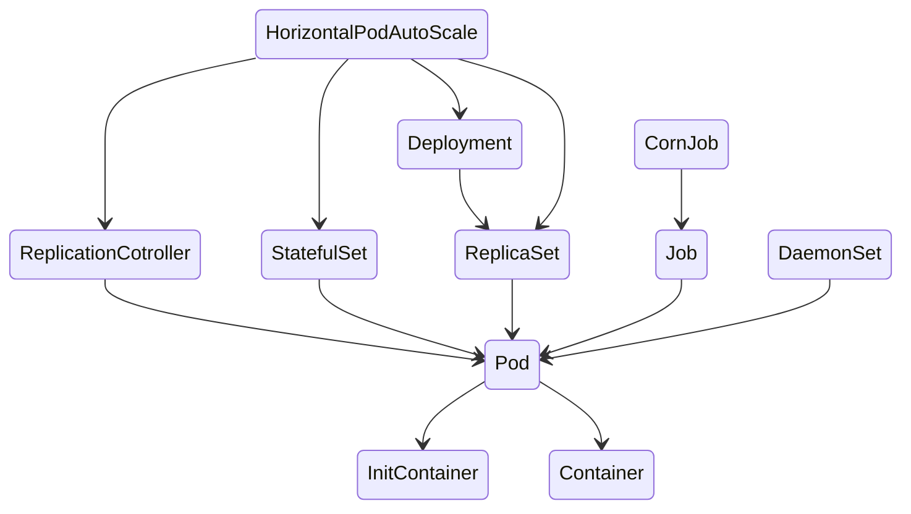

# K8s Pod 控制器

##   **07 K8s Pod 控制器**



### **1. RC/RS 控制器**

在kubernetes v1.2版本之前，Kubernetes中默认的分片管理工具是Replication Controller，v1.2版本以后，升级成了一个新的概念Replica-Set。Deployment内部采用的就是Replica-Set。

Replica-Set和RC之间最大的区别在于RC只支持基于等式的label-Selector，而Replica-Set支持基于集合的Label-Selector。

RC主要用来声明某种Pod的副本数量在任意时刻都能符合预期值。定义包括以下几个方面：
1）Pod的副本数量；
2）用于筛选Pod的标签选择器；
3）定义Pod的模板用于创建新Pod时使用。

当定义RC并提交到Kubernetes集群后，Master节点上的Controller Manager组件会定期巡检当前存活目标的Pod副本数，保证副本数符合预期值。如果有过多的Pod在运行，会停掉一些Pod，如果少于预期值，会根据模板自动创建。通过使用RC，Kubernetes实现了用户集群高可用性，并减少了运维工作量。

#### **Label and Selector**

标签是关键值对，可以配置到 K8s 中任何的对象（例如 Pods）。标签用于根据要求组织和选择子对象集。许多对象可以具有相同的标签。标签不为对象提供独特性。

```sh
kubectl label resource-name app=test
```

#### **Label Selectors – 标签选择器**

通过标签选择器，我们可以选择对象的子集。K8s 支持两种类型的选择器：

- 基于平等的选择器
  - 基于平等的选择器允许基于标签键和值对对象进行过滤。使用这种类型的选择器，我们可以使用 [，]，或！例如，通过 env=dev，我们选择的是设置 env 标签的对象。

- 基于设置的选择器
  - 基于设置的选择器允许基于一组值对对象进行筛选。使用这种类型的选择器，我们可以使用内、不和存在操作员。例如，在 env 中（dev，qa），我们选择的对象是 env 标签设置为开发或卡。

```
kubectl get rc owide
kubectl get pod -–show-label
kubectl get rs -owide

kubectl label nodes k8s-master env- #删除节点标签env=env
kubectl label nodes k8s-master env=env #给节点添加一个标签env=env
```

#### **ReplicaSet/Replication Controller 创建**

RS 的 yaml 文件创建

```yaml
apiVersion: apps/v1
kind: ReplicaSet
metadata:
  name: frontend
  labels:
    app: guestbook
    tier: frontend
spec: # modify replicas acc replicas: 3 selector: matchLabels: tier: frontend
  replicas: 3
  selector:
    matchLabels:
      tier: frontend
  # --------------------------------------------
  template:
    metadata:
      labels:
        tier: frontend
    spec:
      containers:
      - name: nginx1
        image: nginx
```

**RS 自愈能力**

```
kubectl delete rs
```

**RS 多副本**

**RS 扩缩容能力**

```
kubectl scale name -replicas=2
```

### **2. Deployment** 

> 控制Pod，使Pod拥有多副本，自愈，扩缩容等能力

#### **Deployment 的多副本能力**

```
kubectl create deploy my-dep --image=nginx --replicas=3
```

#### **Deployment 扩缩容能力**

```
kubectl scale --replicas=5 deploy/my-dep
```
#### Deployment 滚动更新
**Deployment upgrade**
- Method 1
  - kubectl set image deployment/NAME container:name=imagename:version
  - kubectl set image deployment/myngx myngx=nginx:latest
- Method2：
  - kubectl edit deployment name
- Method3：  
  - kubectl apply –f yaml file
- 生成一个新的 RS

**check 升级记录**
- kubectl rollout history deployment/name
- kubectl rollout history deployment/name --revision=3
- kubectl get rs -owide
- kubectl get deployments.apps myngx -o yaml # check metadata.generation: 2
- This number is same with RS # rollback is not counted.
##### RollingUpdate Parameter
```yaml
strategy:
  rollingUpdate:
    maxSurge: 25%
    maxUnavailable: 25%
  type: RollingUpdate
```
**maxSurge string**
- 可调度的 Pod 最大数量超过所需数量 pod。值可以是绝对数（例如：5）或所需值的百分比豆荚（ex:10%）。绝对数通过四舍五入从百分比计算。默认为 25%。 • 例子：
- 当该值设置为 30%时，当滚动更新开始时可以立即放大新的复制集，旧的和 新的 pod 不超过所需吊舱的 130%。一旦老 pod 被杀死，新的 ReplicaSet可以进一步扩展，确保 POD 的总数在更新过程中的任何时间运行最多为所需 POD 的 130%。
**maxUnavailable string**
- 更新期间不可用的最大 pod。价值可以是绝对数（例如：5）或所需 pod 的百分比 （例如：10%). 绝对数由百分比向下舍入计算得出。这如果 MaxSurge 为 0，则不能为 0。默认值为 25%。 
- 示例： 
- 设置此选项时到 30%，旧的 pod 可以缩小到所需 POD 的 70%滚动更新开始时立即执行。一旦新 pod 准备好，旧豆荚 ReplicaSet 可以进一步缩小，然后再放大新的 ReplicaSet，确保始终可用的 POD 总数在更新过程中，至少有70%的 POD 是所需的。
#### Deployment 版本回退能力
```shell
# 回滚到上一个版本：
kubectl rollout undo deployment/NAME
# 回滚到先前的任何版本
kubectl rollout undo deployment/nginx-deployment --to-revision=2
```
### 3.DaemonSet

DaemonSet 能够让所有（或者一些特定）的 Node 节点运行同一个 pod。当节点加入到kubernetes 集群中，pod 会被（DaemonSet）调度到该节点上运行，当节点从 kubernetes 集群中被移除，被（DaemonSet）调度的 pod 会被移除，如果删除 DaemonSet，所有跟这个DaemonSet 相关的 pods 都会被删除。在使用 kubernetes 来运行应用时，很多时候我们需要在一个区域（zone）或者所有 Node 上运行同一个守护进程（pod）。

例如如下场景：

- 每个 Node 上运行一个分布式存储的守护进程，例如 glusterd，ceph
- 每个 Node 上运行日志采集器，例如 fluentd，logstash

```yaml
apiVersion: apps/v1
kind: DaemonSet
metadata:
  name: ds1
  namespace: kube-system
  labels:
    k8s-app: fluentd-logging
spec:
  selector:
    matchLabels:
      name: fluentd-elasticsearch
  template:
    metadata:
      labels:
        name: fluentd-elasticsearch
    spec:
      tolerations:
        - key: node-role.kubernetes.io/master
          effect: NoSchedule
      containers:
        - name: fluentd-elasticsearch
          image: nginx:1.7.9
      resources:
        limits:
          memory: 200Mi
        requests:
          cpu: 100m
          memory: 200Mi
```


### **4.Job and Cronjob** 

在有些场景下，是想要运行一些容器执行某种特定的任务，任务一旦执行完成，容器也就没有存在的必要了。在这种场景下，创建 pod 就显得不那么合适。于是就是了 Job，Job 指的就是那些一次性任务。通过 Job 运行一个容器，当其任务执行完以后，就自动退出，集群也不再重新将其唤醒。

从程序的运行形态上来区分，可以将 Pod 分为两类：长时运行服务（jboss、mysql 等）和一次性任务（数据计算、测试）。RC 创建的 Pod 都是长时运行的服务，Job 多用于执行一次性任务、批处理工作等，执行完成后便会停止（status.phase 变为 Succeeded）。

job 执行完后，不会自动启动一个新的 pod。执行完成后 pod 便会停止，也不会被自动删除。

#### **Job**

```
kubectl create job test1 --image=nginx:1.9
```

```yaml
apiVersion: batch/v1
kind: Job
metadata:
 name: job-demo
spec:
 template:
   metadata:
     name: job-demo
   spec:
     restartPolicy: Never
     containers:
     - name: counter
       image: busybox
       command:
       - "bin/sh"
       - "-c"
       - "for i in 9 8 7 6 5 4 3 2 1; do echo $i; done"
     imagePullPolicy: IfNotPresent
```

#### **CronJob**

```yaml
apiVersion: batch/v1beta1
kind: CronJob
metadata:
  name: cronjob-demo
spec:
  schedule: "*/1 * * * *"
  jobTemplate:
    spec:
      template:
        spec:
          containers:
            - name: counter
              image: busybox
              command:
                - "bin/sh"
                - "-c"
                - "for i in 9 8 7 6 5 4 3 2 1; do echo $i; done"
          restartPolicy: OnFailure
```

###  **5.Statefulset** 

**StatefulSet 是为了解决有状态服务的问题**

有下面的任意要求时，StatefulSet 的价值就体现出来了。 

- 稳定的、唯一的网络标识。 

-  稳定的、持久化的存储。 

- 有序的、优雅的部署和扩展。 

- 有序的、优雅的删除和停止。

```yaml
apiVersion: apps/v1
kind: StatefulSet
metadata:
  name: web
spec:
  serviceName: "nginx"
  replicas: 3
  selector:
    matchLabels:
 	  app: nginx
template:
  metadata:
    labels:
 	  app: nginx
 	spec:
	  containers:
 	  - name: nginx
 		image: nginx:1.9
 		ports:
 		- containerPort: 80
 		  name: web
```

StatefulSet 组成 用于定义网络标志（DNS domain）的 Headless Service用于创建 PersistentVolumes 的 volumeClaimTemplates

定义具体应用的 StatefulSet。

**StatefulSet中 每 个Pod的DNS格式为statefulSetName-{0..N-1}.serviceName.namespace.svc.cluster.local**

示例:`web-0.nginx.default.svc.cluster.local`

- serviceName 为 Headless Service 的名字  
- 0..N-1 为 Pod 所在的序号，从 0 开始到 N-1
- statefulSetName 为 StatefulSet 的名字
- namespace 为服务所在的 namespace，
- Headless Service 和 StatefulSet 必须在相同的 namespace.cluster.local 为 Cluster Domain，

### 6 工作负载

| 控制器      |                | 比如                               |
| ----------- | -------------- | ---------------------------------- |
| Deployment  | 无状态应用部署 | 微服务、提供多副本等功能           |
| StatefulSet | 有状态应用部署 | Redis、提供稳定存储、网络等功能    |
| DaemonSet   | 守护型应用部署 | 日志收集组件、在每个机器都运行一份 |
| Job/CornJob | 定时任务部署   | 垃圾清理组件、可以在指定时间运行   |

