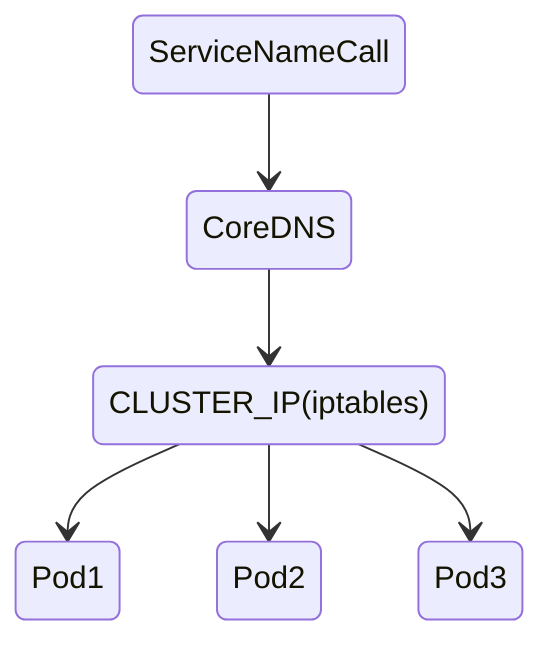
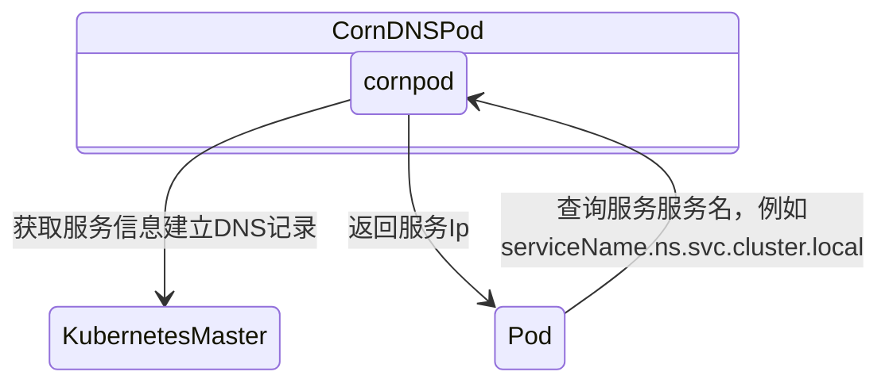

# 08 服务介绍

> Service 将运行在一组 Pods 上的应用程序公开为网络服务的抽象方法。使用 Kubernetes，你无需修改应用程序即可使用不熟悉的服务发现机制。 Kubernetes 为Pods 提供自己的 IP 地址，并为一组 Pod 提供相同的 DNS 名， 并且可以在它们之间进行负载均衡。Kubernetes Service 定义了这样一种抽象：逻辑上的一组 Pod，一种可以访问它们的策略 — — 通常称为微服务。 Service 所针对的 Pods 集合通常是通过选择算符来确定的。

## **1.Service 服务 ClusterIP 方式** 

### **1.创建 ClusterIP 服务**

服务的连接对所有的后端 pod 是负载均衡的，至于哪些 pod 被属于哪个服务，通过在定义服务的时候设置标签选择器；

**Yaml方式**

```yaml
apiVersion: apps/v1
kind: Deployment
metadata:
  name: test1
spec:
  replicas: 1
  selector:
    matchLabels:
      app: test1
  template:
    metadata:
      labels:
        app: test1
  spec:
    containers:
      - image: nginx:1.7.9
        name: test
        ports:
          resources:
            requests:
              cpu: 0.1
              limits:
                cpu: 1
---
apiVersion: v1
kind: Service
metadata:
  name: test1
spec:
  ports:
    - name: myngx
      port: 2180
      targetPort: 80
  selector:
    app: test1
```

**命令行创建**
```sh
kubectl get pod/deployment
kubectl expose deployment test1 –-name=test2 -–port=3280
kubectl create svc
```
使用之前的 yaml 文件创建 pod，模版中设置的标签为 app: test1，所以创建服务的 yaml（还有之前介绍的 kubectl expose 方式也可以创建服务）中也需要指定相同的标签：首先指定的资源类型为 Service，然后指定了两个端口分别：port 服务提供的端口，targetPort指定 pod 中进程监听的端口，最后指定标签选择器，相同标签的 pod 被当前服务管理；

```sh
kubectl get svc
```

创建完服务之后，可以发现给 kubia 分配了 CLUSTER-IP，这是一个内部 ip；至于如何测试可以使用 kubectl exec 命令远程地在一个已经存在的 pod 容器上执行任何命令；pod 名称可以随意指定三个中的任何一个，接收到 crul 命令的 pod，会转发给 Service，由 Service 来决定将请求交给哪个 pod 处理，所以可以看到多次执行，发现每次处理的 pod 都不一样；如 果 希 望 特 定 客 户 端 产 生 的 所 有 请 求 每 次 都 指 向 同 一 个 pod, 可以设置服务的sessionAffinity 属性为 ClientIP； 


> 1. 通过ServiceName访问
> 2. CoreDNS解析ServiceName，返回ClusterIP
> 3. ClusterIP根据机器上iptables配置，转发到指定Pod

### **2.测试 Service 的服务发现**

**Service、EndPoint、Pod之间的关系**
```html
<table>
   	<tr>
     	<td colspan=3 style="text-align:center">Service: Nginx-Service spac.selector: app=nginx</th>
  	</tr>
   	<tr>
     	<td colspan=3 style="text-align:center">EndPoint:Nginx-Service (PodIP:Port, PodIP:Port, PodIP:Port) </th>
  	</tr>
  	<tr>
  		<td>Nginx Pod labels: app=nginx</th>
      <td>Nginx Pod labels: app=nginx</th>
      <td>Nginx Pod labels: app=nginx</th>
  	</tr>
</table>
```

如果使用 ipvs，当你创建 Service 的时候，kube-proxy 会获取 Service 对应的 Endpoint，调用 LVS 帮我们实现负载均衡的功能。

通过删除和增加 Pod 观看服务发现的作用

```sh
kubectl exec -it pod-name -- sh
echo 111 > /usr/share/nginx/html/index.html
echo 222> /usr/share/nginx/html/index.html
echo 333 > /usr/share/nginx/html/index.html
cat /usr/share/nginx/html/index.html
curl serviceIP:port
```

### **3.Headless service clusterIP**

顾名思义，就是没头的 Service。有啥用呢？很简单，dns 查询会如实的返回 2 个真实的Endpoint,有时候 client 想自己来决定使用哪个 Real Server，可以通过查询 DNS 来获取 Real Server 的信息。Headless Service 的对应的每一个 Endpoints，即每一个 Pod，都会有对应的 DNS 域名；这样 Pod 之间就可以互相访问。

> 1. 通过无头的ServiceName访问
> 2. 由于没有ClusterIP，也就无法指定转发规则（iptables）和负载均衡（loadbalance）
> 3. 因此只能返回所有的待转发对象（Pod）的请求方式
> 4. 命名规则${podName}.${headlessServiceName}.${nameSpace}.${clusterDomainname}，一般指定到headlessServiceName

```yaml
apiVersion: v1
kind: Service
metadata:
  name: nginx
  labels:
    app: nginx
spec:
  ports:
  - port: 80
    name: web
    clusterIP: None
    selector:
      app: nginx
---
apiVersion: apps/v1
kind: StatefulSet
metadata:
  name: web
spec:
  serviceName: "nginx"
  replicas: 3
  selector:
    matchLabels:
      app: nginx
    template:
      metadata:
        labels:
          app: nginx
    spec:
      containers:
      - name: nginx
      image: nginx:1.9
      ports:
      - containerPort: 80
      name: web
```

### **4.同一个 deployment 暴露多次显示多个服务名称**

如果 pod 监听了两个或者多个端口，那么服务同样可以暴露多个端口

```yaml
apiVersion: apps/v1
kind: Deployment
metadata:
  name: test1
spec:
  replicas: 1
  selector:
    matchLabels:
    app: test1
  template:
   metadata:
    labels:
      app: test1
    spec:
      containers:
      - image: nginx:1.7.9
        name: test
        ports:
      - containerPort: 80
      resources:
        requests:
          cpu: 10m
          limits:
            cpu: 100m
---
apiVersion: v1
kind: Service
metadata:
  name: test1
spec:
  selector:
    app: test1
    ports:
    - name: myngx
      port: 2180
      targetPort: 80
    - name: myngx1
      port: 3180
      targetPort: 80
```

### **5.使用命名的端口**

在 Service 中指定了端口为 8080，如果目标端口变了这里也需要改变，可以在定义 pod 的模版中给端口命名，在 Service 中可以直接指定名称:

```yaml
apiVersion: apps/v1
kind: Deployment
metadata:
  name: test1
spec:
  replicas: 1
  selector:
  matchLabels:
    app: test1
  template:
    metadata:
    labels:
      app: test1
    spec:
      containers:
      - image: nginx:1.7.9
        name: test
        ports:
        - name: http
          containerPort: 80
      resources:
        requests:
          cpu: 0.1
          limits:
            cpu: 1
---
apiVersion: v1
kind: Service
metadata:
  name: test1
spec:
  ports:
  - name: myngx-http
    port: 2180
    targetPort: http
  selector:
    app: test1
```

targetPort 直接使用了名称 http

### **6.服务注册和域名发现 – CoreDNS**

**服务注册**

创建服务时，增加相应的 key/value 进入 etcd. 

Servicename:clusterip through API-server.

Deployment 

Service domain name 

myngx.default.svc.cluster.local  FQDN

**服务发现**

1. Coredns
2. Host – dns configuration 

服务给我们提供了一个单一不变的 ip 去访问 pod，那是否每次都要先创建服务，然后找到服务的 CLUSTER-IP，再给其他 pod 去使用；这样就太麻烦了，Kubernets 还提供了其他方式去访问服务；

```sh
kubectl run curl --image=radial/busyboxplus:curl -it -- sh

nslookup my-nginx：
```

#### **通过环境变量发现服务** 

在 pod 开始运行的时候，Kubernets 会初始化一系列的环境变量指向现在存在的服务；如果创建的服务早于客户端 pod 的创建，pod 上的进程可以根据环境变量获得服务的 IP 地址和端口号；

```sh
kubectl exec -it test1-7b544844bb-5zxxx --env
```

Service 还没创建，所有没有这个服务的环境变量，即使创建后也不会有 test2 服务的环境变量。

Service创建后，如果删除 pod 重新创建新的 pod，这样服务就在创建 pod 之前了，再次获取环境变量可以发现KUBIA_SERVICE_HOST 和 KUBIA_SERVICE_PORT，分别代表了 test2 服务的 IP 地址和端口号；这样就可以通过环境变量去获取 IP 和端口了

#### DNS 域名解析过程

作为服务发现机制的基本功能，在集群内需要能够通过服务名对服务进行访问，这就需要一个集群范围内的 DNS 服务来完成从服务名到 ClusterIP 的解析。

从 Kubernetes 1.11 版本开始，Kubernetes 集群的 DNS 服务由 CoreDNS 提供。CoreDNS 是 CNCF 基金会的一个项目，是用 Go 语言实现的高性能、插件式、易扩展的 DNS服务端。CoreDNS 解决了 KubeDNS 的一些问题，例如 dnsmasq 的安全漏洞、externalName 不能使用 stubDomains 设置，等等。

CoreDNS 支持自定义 DNS 记录及配置 upstream DNS Server，可以统一管理 Kubernetes 基于服务的内部 DNS 和数据中心的物理 DNS。

CoreDNS 没有使用多个容器的架构，只用一个容器便实现了 KubeDNS 内 3 个容器的全部功能。

CoreDNS 的总体架构:



>当一个service创建之后，在etcd 中，注册servicename：Servicename:clusterip等信息， 然后CoreDns  会在kubernets master 中订阅服务，进行watch list。
>
>当ervice创建之后，kubernetes master通知 CoreDns，建立DNS关系。
>
>Pod会从conredns中查询service，例如：servicename.ns1.svc.cluster.local，找到映射的ip，如：169.169.58.168

#### ServiceName的DNS解析举例

在centos下，安装必要功能

```
yum -y install bind-utils
kubectl run c5 -it --image=registry.cn-hangzhou.aliyuncs.com/liuyik8s/centos:dns – sh
```

接下来使用一个带有 nslookup 工具的 Pod 来验证 DNS 服务能否正常工作：

```
kubectl run curl --image=radial/busyboxplus:curl -i
```

然后，按回车并执行nslookup kubernets 命令，查看kubernetes集群服务情况

```
nslookup kubernetes
Server: 10.20.0.10
Address 1: 10.20.0.10 kube-dns.kube-system.svc.cluster.local
Name: kubernetes
Address 1: 10.20.0.1 kubernetes.default.svc.cluster.local
```

可以看到，通过 DNS 服务器，成功找到了 test1 服务的 IP 地址：10.20.45.33。

#### **查找同命名空间的服务**

如果某个 Service 属于不同的命名空间，那么在进行 Service 查找时，需要补充 Namespace 的名称，组合成完整的域名。下面以查找 kube-dns 服务为例，将其所在的 Namespace“kube-system”补充在服务名之后，用“.”连接为“kube-dns.kube-system”，即可查询成功：

```
nslookup kube-dns.kube-system
```

如果仅使用“kube-dns”进行查找，则会失败：

```
nslookup kube-dns
Server: 10.96.0.10
Address: 10.96.0.10#53
** server can't find kube-dns: NXDOMAIN
```

#### 域名解析过程分析

##### resolv.conf 文件分析 

部署 pod 的时候，如果用的是 K8s 集群的 DNS，那么 kubelet 在起 pause 容器的时候， 会将其 DNS 解析配置初始化成集群内的配置。

比如刚才创建了一个叫 pod1 的 pod，它的 resolv.conf 文件如下： 

```
kubectl exec -it pod1 -- sh 
/ # cat /etc/resolv.conf 
nameserver 10.96.0.10
search default.svc.cluster.local svc.cluster.local cluster.local 
options ndots:5
```

在集群中 pod 之间互相用 svc name 访问的时候，会根据 resolv.conf 文件的 DNS 配置 来解析域名，下面来分析具体的过程。

pod 的 resolv.conf 文件主要有三个部分，分别为 nameserver、search 和 option。

而这三 个部分可以由 K8s 指定，也可以通过 pod.spec.dnsConfig 字段自定义。

- **nameserver**

  resolv.conf 文件的第一行 nameserver 指定的是 DNS 服务的 IP，这里就是 coreDNS 的 clusterIP

  ```
  kubectl get services -n kube-system -o wide
  NAME TYPE CLUSTER-IP EXTERNAL-IP PORT(S) 
  AGE SELECTOR
  kube-dns ClusterIP 10.96.0.10 <none> 53/UDP,53/TCP,9153/TCP 24h 
  k8s-app=kube-dns
  ```

  也就是说所有域名的解析，都要经过 coreDNS 的虚拟 IP 10.96.0.10 进行解析，不论是 Kubernetes 内部域名还是外部的域名。

- **search 域**

  resolv.conf 文件的第二行指定的是 DNS search 域。解析域名的时候，将要访问的域名依次 带入 search 域，进行 DNS 查询。
  
   比如我要在刚才那个 pod 中访问一个域名为 dnsutils 的服务，其进行的 DNS 域名查询的 顺序是： dnsutils.default.svc.cluster.local -> dnsutils.svc.cluster.local -> dnsutils.cluster.local  直到查到为止

- **options**
  resolv.conf 文件的第三行指定的是其他项，最常见的是 dnots。dnots 指的是如果查询的域 名包含的点 “.” 小于 5，则先走 search域，再用绝对域名；如果查询的域名包含点数大于 或等于 5，则先用绝对域名，再走 search 域。
  K8s 中默认的配置是 5。 也就是说，如果我访问的是 a.b.c.e.f.g ，那么域名查找的顺序如下：
	```
	a.b.c.e.f.g. -> a.b.c.e.f.g.default.svc.cluster.local -> a.b.c.e.f.g.svc.cluster.local ->  a.b.c.e.f.g.cluster.local
	```
  如果我访问的是 a.b.c.e，那么域名查找的顺序如下：
  ```
  a.b.c.e.default.svc.cluster.local -> a.b.c.e.svc.cluster.local -> a.b.c.e.cluster.local -> a.b.c.e
  ```

#### 查看 CoreDNS 信息

k8s 的 v1.20.5 版本在集群启动时，已经启动了 coreDNS 域名服务。 

在部署 CoreDNS 应用前，至少需要创建一个 ConfigMap、一个 Deployment 和一个 Service 共 3 个资源对象。ConfigMap“coredns”主要设置 CoreDNS 的主配置文件 Corefile 的内容， 其中可以定义各种域名的解析方式和使用的插件。

```sh
kubectl get configmap -n kube-system

kubectl edit configmap coredns -n kube-system 
```

其中，各插件说明：

1. errors：错误信息到标准输出。 
2. health：CoreDNS 自身健康状态报告，默认监听端口 8080，一般用来做健康检查。您可以通 过 http://localhost:8080/health 获取健康状态。
3. ready：CoreDNS 插件状态报告，默认监听端口 8181，一般用来做可读性检查。可以通过 http://localhost:8181/ready 获取可读状态。当所有插件都运行后，ready 状态为 200。 
4. kubernetes：CoreDNS kubernetes 插件，提供集群内服务解析能力。
5. prometheus：CoreDNS 自身 metrics 数据接口。可以通过http://localhost:9153/metrics 获取 prometheus 格式的监控数据。 forward（或 proxy）：将域名查询请求转到预定义的 DNS 服务器。默认配置中，当域名不在 kubernetes 域时，将请求转发到预定义的解析器（/etc/resolv.conf）中。默认使用宿主机的 /etc/resolv.conf 配置。 
6. cache：DNS 缓存。 
7. loop：环路检测，如果检测到环路，则停止 CoreDNS。 
8. reload：允许自动重新加载已更改的 Corefile。编辑 ConfigMap 配置后，请等待两分钟以使 更改生效。

9. loadbalance：循环 DNS 负载均衡器，可以在答案中随机 A、AAAA、MX 记录的顺序。 在下面的示例中为域名“ cluster.local ”设置了一系列插件，包括 errors 、health、kubernetes、 prometheus、forward、cache、loop、reload 和 loadbalance，在进行域名解析时，这些插件 将以从上到下的顺序依次执行。 另外，etcd 和 hosts 插件都可以用于用户自定义域名记录。 下面是使用 etcd 插件的配置示例，将以“.com”结尾的域名记录配置为从 etcd 中获取，并将 域名记录保存在/skydns 路径下

####  Pod级别DNS配置说明

除了使用集群范围的 DNS 服务（如 CoreDNS），在 Pod 级别也能设置 DNS 的相关策略和配 置。在 Pod 的 YAML 配置文件中通过 spec.dnsPolicy 字段设置 DNS 策略，例如：

```yaml
apiVersion: v1
kind: Pod
metadata:
 namespace: default
 name: dns-example
spec:
 containers:
 - name: test
 image: nginx
 dnsPolicy: "Default"
```

目前可以设置的 DNS 策略如下。

-  Default：继承 Pod 所在宿主机的 DNS 设置。
-  ClusterFirst：优先使用 Kubernetes 环境的 DNS 服务（如 CoreDNS 提供的域名解析服务）， 将无法解析的域名转发到从宿主机继承的 DNS 服务器。
- ClusterFirstWithHostNet：与 ClusterFirst 相同，对于以 hostNetwork 模式运行的 Pod，应 明确指定使用该策略。 
-  None：忽略 Kubernetes 环境的 DNS 配置，通过 spec.dnsConfig 自定义 DNS 配置。这个 选项从 Kubernetes 1.9 版本开始引入，到 Kubernetes 1.10 版本升级为 Beta 版，到 Kubernetes  1.14 版本升级为稳定版。

以下面的 dnsConfig 为例：

```yaml
apiVersion: v1
kind: Pod
metadata:
 namespace: default
 name: dns-example
spec:
 containers:
 - name: test
 image: nginx
 dnsPolicy: "None"
 dnsConfig:
 nameservers:
 - 1.2.3.4
 searches:
 - ns1.svc.cluster.local
 - my.dns.search.suffix
 options:
 - name: ndots
   value: "2"
 - name: edns0
```

### 7.**Kubernetes 负载均衡的实现**

Clusterip – podIP 对应表。

Kube-proxy – from etcd 1:1 1:m

kube-proxy 的 Service 的 iptables 模式与 IPVS 模式的对比

IPTABLES 模式实现原理

IPVS 模式实现原理：主流的方式

ip addr

而接下来，kube-proxy 就会通过 Linux 的 IPVS 模块，为这个 IP 地址设置三个 IPVS 虚拟主机，并设置这三个虚拟主机之间使用轮询模式 (rr) 来作为负载均衡策略。我们可以通过 ipvsadm 查看到这个设置，如下所示：

```
kubectl get svc
ipvsadm -ln |grep 10.20.207.99 -C5
```
可以看到，这三个 IPVS 虚拟主机的 IP 地址和端口，对应的正是三个被代理的 Pod。这时候，任何发往 10.102.128.4:80 的请求，就都会被 IPVS 模块转发到某一个后端 Pod 上了。而相比于 iptables，IPVS 在内核中的实现其实也是基于 Netfilter 的 NAT 模式，所以在转发这一层上，理论上 IPVS 并没有显著的性能提升。但是，IPVS 并不需要在宿主机上为每个 Pod 设置 iptables 规则，而是把对这些“规则”的处理放到了内核态，从而极大地降低了维护这些规则的代价。

不过需要注意的是，IPVS 模块只负责上述的负载均衡和代理功能。而一个完整的 Service 流程正常工作所需要的包过滤、SNAT 等操作，还是要靠 iptables 来实现。只不过，这些辅助性的 iptables 规则数量有限，也不会随着 Pod 数量的增加而增加。

在大规模集群里，建议 kube-proxy 设置–proxy-mode=ipvs 来开启这个功能。它为Kubernetes 集群规模带来的提升，还是非常巨大的。

Service 与 DNS 的关系。在 Kubernetes 中，Service 和 Pod 都会被分配对应的 DNS A 记录（从域名解析 IP 的记录）。对于 ClusterIP 模式的 Service 来说，它的 A 记录的格式是：`..svc.cluster.local`。当你访问这条 A 记录的时候，它解析到的就是该 Service 的 VIP 地址。而对于指定了 clusterIP=None 的 Headless Service 来说，它的 A 记录的格式也是：`..svc.cluster.local`。但是，当你访问这条 A 记录的时候，它返回的是所有被代理的 Pod 的 IP 地址的集合。当然，如果你的客户端没办法解析这个集合的话，它可能会只会拿到第一个 Pod 的 IP 地址。

## **2.服务暴露 NodePort 方式**

### **1.三种地址和端口**

**具体的 pod**

- targetPort : PodIP  \- container port 

  The port on the pod that the service should proxy traffic to.targetPort 很好理解，**targetPort 是 pod 上的端口**，从 port 和 nodePort 上到来的数据最终经过 kube-proxy 流入到后端 pod 的 		targetPort 上进入容器。PodIP:**targetPort (container’s port)**

**具体的服务名字和 IP**

- Port : ServiceIP/clusterIp

  The port that the service is exposed on the service’s cluster ip (virsual ip). Port is the service port which is accessed by others with cluster ip.即，这里的 port 表示：service 暴露在 cluster ip 上的端口，**clusterIp:port** 是提供给集群**内部客户**访问 service 的入口。

**对应的宿主机-物理机或者虚拟机**

- NodePort : NodeIP

  On top of having a cluster-internal IP, expose the service on a port on each node of the cluster (the same port on each node). You'll be able to contact the service on any**nodeIP:nodePort**address. So nodePort is alse the service port which can be accessed by the node ip by others with external ip.首先，nodePort 是 kubernetes 提供给集群外部客户访问 service 入口的一种方式（另一种方式是 LoadBalancer），所以，**nodeIP:nodePort** 是**提供给集群外****部客户访问** service 的入口。考虑到安全因素，这个方法不被推荐。相当于后门。

>  **port、nodePort 总结**
>
> 总的来说，port 和 nodePort 都是 service 的端口，前者暴露给集群内客户访问服务，后者暴露给集群外客户访问服务。从这两个端口到来的数据都需要经过反向代理 kubeproxy 流入后端 pod 的 target Pod，从而到达 pod 上的容器内

### **2.NodePort 类型的服务**

创建一个服务并将其类型设置为 NodePort，通过创建 NodePort 服务，可以让 kubernetes在其所有节点上保留一个端口（所有节点上都使用相同的端口号），然后将传入的连接转发给 pod；

Deployment and Service

```
apiVersion: apps/v1
kind: Deployment
metadata:
  name: test1
spec:
  replicas: 1
  selector:
    matchLabels:
      app: test1
  template:
    metadata:
      labels:
        app: test1
  spec:
    containers:
    - image: nginx:1.7.9
      name: test
      ports:
      - containerPort: 80
    resources:
      requests:
        cpu: 0.1
        limits:
          cpu: 1
---
apiVersion: v1
kind: Service
metadata:
  name: test1
spec:
  ports:
  - name: myngx
    port: 2180
    targetPort: 80
    nodePort: 32187
  selector:
    app: test1
  type: NodePort
```

指定服务类型为 NodePort，节点端口为 32187；

使用 nodeport 方式访问在 cluster 外部访问http://192.168.56.5:32187

### **3.LoadBalance 类型服务** 

相比 NodePort 方式可以通过任何节点的 30312 端口访问内部的 pod，LoadBalancer 方式拥有自己独一无二的可公开访问的 IP 地址；LoadBalance 其实是 NodePort 的一种扩展，使得服务可以通过一个专用的负载均衡器来访问

#### **1.MetaLb 负载均衡**

Kubernetes 没 有 为 裸 机 集 群 提 供 网 络 负 载 平 衡 器 的 实 现 （ svc 类 型 为loadbalance）,Kubernetes 附带的 Network LB 的实现都是调用各种 IaaS 平台（GCP，AWS，Azure 等）的粘合代码。如果未在受支持的 IaaS 平台（GCP，AWS，Azure 等）上运行，则 LoadBalancers 在创建时将无限期保持 pending 状态metalb 解决了这种问题，使得裸机集群也能使用 svc 类型为 loadbalancer。

MetaLB 是搭建私有 Kubernet 集群负载均衡的利器，可以提供 Layer 2 mode 和 BGP 模式的负载均衡。

Layer 2 模式下，每个 Service 会有集群中的一个 Node 来负责。服务的入口流量全部经由单个节点，然后该节点的 Kube-Proxy 会把流量再转发给服务的 Pods。也就是说，该模式下 MetalLB 并没有真正提供负载均衡器。尽管如此，MetalLB 提供了故障转移功能，如果持有 IP 的节点出现故障，则默认 10 秒后即发生故障转移，IP 会被分配给其它健康的节点。

**优点：**

是它的通用性：它可以在任何以太网网络上运行，不需要特殊的硬件。

**缺点：**

Layer 2 模式下存在单节点瓶颈，服务所有流量都经过一个 Node 节点。这意味着服务的入口带宽被限制为单个节点的带宽。由于 Layer 2 模式需要 ARP/NDP 客户端配合，当故障转移发生时，MetalLB 会发送 ARP 包来宣告 MAC 地址和 IP 映射关系的变化，地址分配略为繁琐。

创建 kubernets 域名空间

```yaml
apiVersion: v1
kind: Namespace
metadata:
 name: metallb-system
 labels:
 	app: metallb
```

安装 MeltLb 负载均衡

```sh
kubectl create ns metallb-system

wget https://raw.githubusercontent.com/google/metallb/v0.8.3/manifests/metallb.yaml
kubectl apply -f metallb.yaml

kubectl create -f cm.yaml

kubectl create secret generic -n metallb-system memberlist --from-literal=secretkey="$(openssl rand -base64 128)"

# 查看 kubernets 集群 Node 主机 IP
kubectl get node -o wide
```

负载均衡可以 IP 地址范围取 node 集群 IP 的前三位 IP 地址，第四位设置负责均衡付给 kubernets 集群中应用的可用范围

设置 MetLab 配置信息**Layer 2** **模式负载均衡配置**

```yaml
# cm.yaml
apiVersion: v1
kind: ConfigMap
metadata:
  namespace: metallb-system
  name: config
data:
  config: |
 	address-pools:
 	- name: default
 	  protocol: layer2
 	addresses:
 	- 192.168.56.253-192.168.56.254
```

**bgp**
```yaml
# cm.yaml
apiVersion: v1
kind: ConfigMap
metadata:
  namespace: metallb-system
  name: config
data:
  config: |
    peers:
    - peer-address: 10.0.0.1
      peer-asn: 64501
      my-asn: 64500
    address-pools:
    - name: default
      protocol: bgp
      addresses:
      - 192.168.10.0/24
```

**如何访问**

所以可以发现同样能通过使用 NodePort 的方式来访问服务（节点 IP+节点端口）；同时也可以通过 EXTERNAL-IP 来访问

```
External-IP add:port. Same with clusterIP
```

> 备注：metallb 只负责进行 arp 地址解析及对外发布。不负责数据转发。下面是两个 pod 的 logs

#### **2.部署 loadbalancer 服务**

```sh
kubectl edit svc test1

# type. NodePort --> LoadBalancer
kubectl get svc
```

可以看到虽然我们没有指定节点端口，但是创建完之后自动启动了 32187 节点端口http://192.168.56.252:2180/

## **3.防止不必要的网络跳数**

当外部客户端通过节点端口连接到服务时，随机选择的 pod 并不一定在接收连接的同一节点上运行；可以通过将服务配置为仅将外部通信重定向到接收连接的节点上运行的 pod 来阻止此额外跳数；

```yaml
apiVersion: v1
kind: Service
metadata:
 name: kubia-nodeport-onlylocal
spec:
 type: NodePort
 externalTrafficPolicy: Local
 ports:
 - port: 80
 	 targetPort: 8080
 	 nodePort: 30124
 selector:
   app: kubia
```

通过在服务的 spec 部分中设置 externalTrafficPolicy 字段来完成；

```
kubectl explain service.spec.externalTrafficPolicy
```

