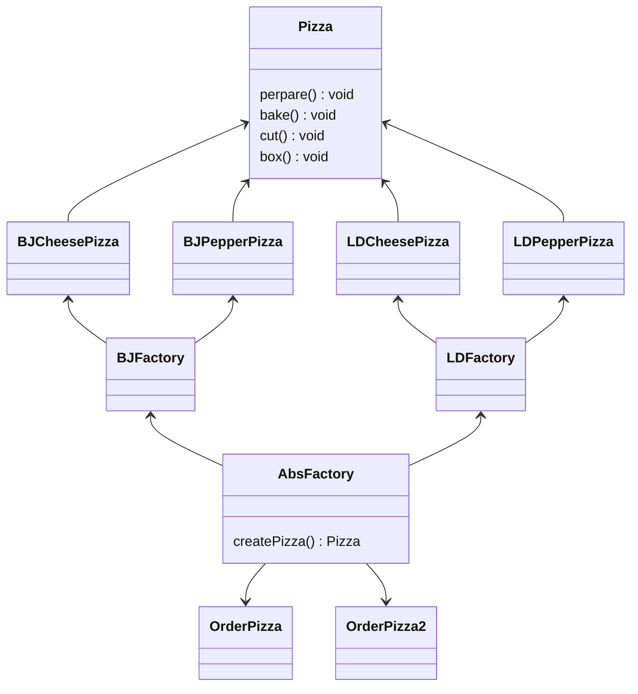

# 一、基本介绍

1. 为访问类提供一个创建一组相关或相互依赖对象的接口，且访问类无须指定所要产品的具体类就能得到同族的不同等级的产品的模式结构；

1. 抽象工厂模式是工厂方法模式的升级版本，工厂方法模式只生产一个等级的产品，而抽象工厂模式可生产多个等级的产品；

1. 使用抽象工厂模式一般要满足以下条件：
 - 系统中有多个产品族， 每个具体工厂创建同族但属于不同等级的产品；
 - 系统一次只可能消费其中某一族产品，即同族的产品一起使用。

 # 二、抽象工厂模式的结构

 抽象工厂模式同工厂方法模式一样，也是由抽象工厂、具体工厂、抽象产品和具体产品等 4 个要素构成，但抽象工厂中方法个数不同，抽象产品的个数也不同。

 抽象工厂模式的主要角色如下：
 ### 1、抽象工厂
 提供了创建产品的接口，它包含多个创建产品的方法 newProduct()，可以创建多个不同等级的产品。

 ### 2、具体工厂
 主要是实现抽象工厂中的多个抽象方法，完成具体产品的创建。

 ###  3、抽象产品
 定义了产品的规范，描述了产品的主要特性和功能，抽象工厂模式有多个抽象产品。

 ### 4、具体产品
 实现了抽象产品角色所定义的接口，由具体工厂来创建，它 同具体工厂之间是多对一的关系。

 # 三、优缺点
 ### 1、优点
 可以在类的内部对产品族中相关联的多等级产品共同管理，而不必专门引入多个新的类进行管理；
 当增加一个新的产品族时不需要修改原代码，满足开闭原则。
 ### 2、缺点
 当产品族中需要增加一个新的产品时，所有的工厂类都需要进行修改。

 # 四、《Head First 设计模式》读后感
   1. 抽象工厂模式提供了一个接口，用于创建相关或依赖对象的家族，而不需要明确指定具体类。
   
   1. 工厂方法模式运用的是继承，抽象工厂模式运用的是对象的组合。

# 五 代码示例
### 1、UML类图

### 2、具体代码
```java
//一个抽象工厂模式的抽象层(接口)
public interface AbsFactory {
	//让下面的工厂子类来 具体实现
	public Pizza createPizza(String orderType);
}
```

```java
//这是工厂子类
public class BJFactory implements AbsFactory {
	@Override
	public Pizza createPizza(String orderType) {
		System.out.println("~使用的是抽象工厂模式~");
		Pizza pizza = null;
		if(orderType.equals("cheese")) {
			pizza = new BJCheesePizza();
		} else if (orderType.equals("pepper")){
			pizza = new BJPepperPizza();
		}
		return pizza;
	}
}
```
```java
public class LDFactory implements AbsFactory {
	@Override
	public Pizza createPizza(String orderType) {
		System.out.println("~使用的是抽象工厂模式~");
		Pizza pizza = null;
		if (orderType.equals("cheese")) {
			pizza = new LDCheesePizza();
		} else if (orderType.equals("pepper")) {
			pizza = new LDPepperPizza();
		}
		return pizza;
	}
}
```
```java
public class OrderPizza {
	AbsFactory factory;
	// 构造器
	public OrderPizza(AbsFactory factory) {
		setFactory(factory);
	}
 
	private void setFactory(AbsFactory factory) {
		Pizza pizza = null;
		String orderType = ""; // 用户输入
		this.factory = factory;
		do {
			orderType = getType();
			// factory 可能是北京的工厂子类，也可能是伦敦的工厂子类
			pizza = factory.createPizza(orderType);
			if (pizza != null) { // 订购ok
				pizza.prepare();
				pizza.bake();
				pizza.cut();
				pizza.box();
			} else {
				System.out.println("订购失败");
				break;
			}
		} while (true);
	}
 
	// 写一个方法，可以获取客户希望订购的披萨种类
	private String getType() {
		try {
			BufferedReader strin = new BufferedReader(new InputStreamReader(System.in));
			System.out.println("input pizza 种类:");
			String str = strin.readLine();
			return str;
		} catch (IOException e) {
			e.printStackTrace();
			return "";
		}
	}
}
```