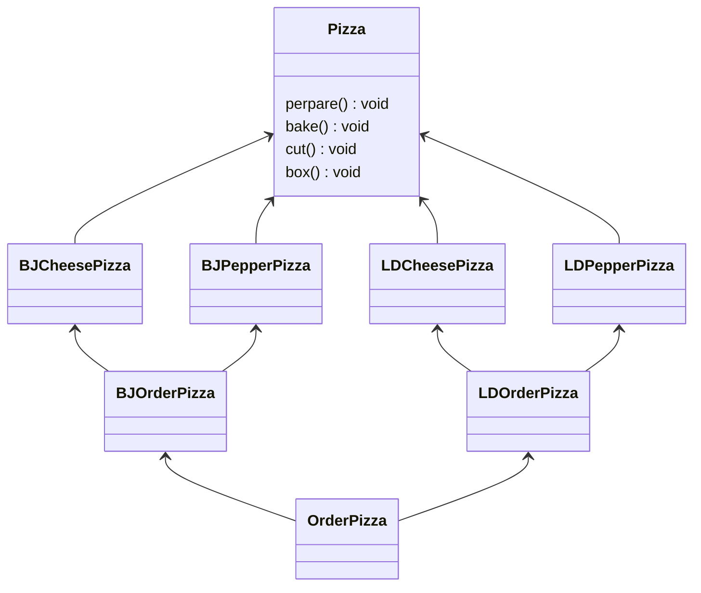

# 一、基本介绍
工厂二字想必大家都不陌生，工厂就是用来建造东西的，我们市面上买的东西比如水杯、玩具、汽车等等都是从工厂生产的，那我们需不需要知道它们是如何生产出来的呢？当然不需要，商家从工厂中直接提货，我们就可以购买了，完全不知道它是如何生产的，这就是工厂方法模式。

工厂方法模式（Factory Method），定义一个用于创建对象的接口，让子类决定实例化哪一个类。工厂方法模式使一个类的实例化延迟到其子类。


# 二、工厂方法模式的优缺点
### 1、优点
1. 良好的封装性、代码结构清晰。
   如一个调用者想创建一个对象，只需要知道其名称即可，降低了模板间的耦合。
1. 扩展性好。如果想增加一个产品，只需扩展一个工厂类即可。
1. 屏蔽产品类,调用者只关心产品的接口。
1. 典型的解耦框架

### 2、缺点
每增加一个产品，就需要增加一个产品工厂的类，增加了系统的复杂度。

# 三、工厂方法模式的应用
### 1、何时使用
不同条件下创建不用实例时。方法是让子类实现工厂接口。

### 2、使用场景
1. 要生成对象的地方。
1. 需要灵活的、可扩展的框架。
1. 数据库访问、数据库可能变化时。

### 3、应用实例
1. 需要一辆汽车，直接从工厂里面提货，不用去管这辆车是怎么做出来的。

1. hibernate换数据库只需换方言和驱动即可。

1. 简单计算器的实现。

# 四、《Head First 设计模式》读后感
1、定义了一个创建对象的接口，但由子类决定实例化的类是哪一个，工厂方法将类的实例化推迟到子类。

2、利用工厂方法创建对象，需要扩展一个类，并覆盖它的工厂方法。整个工厂方法模式就是通过子类来创建对象，只负责将客户从具体类型中解耦。

#  五、代码实例

### 1、Factory类
 ```java
public abstract class Factory {
    public abstract Product createProduct(String owner);
    public abstract void registerProduct(Product p);
    public abstract void getAllProductOwner();
    public Product create(String owner){
        Product p = createProduct(owner);
        registerProduct(p);
        return p;
    }
}
 ```
###  2、IDCardFactory类
```java 
import java.util.ArrayList;
import java.util.List;
 
public class IDCardFactory extends Factory {
    List owners = new ArrayList();
    public Product createProduct(String owner){
        System.out.println("为 "+owner+" 创造产品成功...");
        return new IDCardProduct(owner);
    }
 
    @Override
    public void registerProduct(Product p) {
        String owner=((IDCardProduct)p).getOwner();
        owners.add(owner);
        System.out.println("注册 "+owner+" 的产品成功...");
    }
 
    @Override
    public void getAllProductOwner() {
        for(int i=0;i<owners.size();i++){
            System.out.println("产品用户："+owners.get(i));
        }
    }
}
```
### 3、抽象类 
```java
package designMode.factory;
 
public abstract class Product {
    public abstract void use();
}
```

### 4、 具体实现类
```java
package designMode.factory;
 
public class IDCardProduct extends Product {
    String owner;
 
    public IDCardProduct(String owner) {
        this.owner = owner;
    }
 
    @Override
    public void use() {
        System.out.println("用户 "+owner+" 正在使用产品...");
    }
 
    public String getOwner() {
        return owner;
    }
}
```
### 5、测试类
```java
package designMode.factory;
 
public class FactoryMain {
    public static void main(String[] args) {
        Factory f = new IDCardFactory();
        Product p=f.create("江疏影");
        p.use();
        System.out.println("--------------------");
        p=f.create("邱淑贞");
        p.use();
        System.out.println("--------------------");
        f.getAllProductOwner();
    }
}
```
对于抽象类，必须有构造函数，因为子类的初始化需要先调用抽象类的构造函数，然后是子类的构造函数；但是抽象类的构造函数不能定义成抽象的，因为如果这样的话，将不能被实现，因此没有抽象的构造函数。

# 六、JDK中的工厂模式

# 七、总结
工厂模式使用了继承、接口、抽象等机制，和之前写的迭代器模式、模板模式都是一样的，可以看出设计模式并不是独立的，而是相互之间有关系和区别的，在学习的时候我们要善于总结设计模式之间的共同之处和不同之处，活学活用，才能在以后的大型项目中选择正确的开发方式，事半功倍。